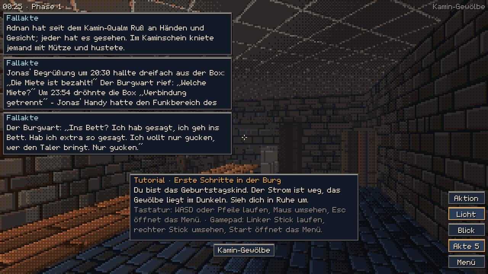
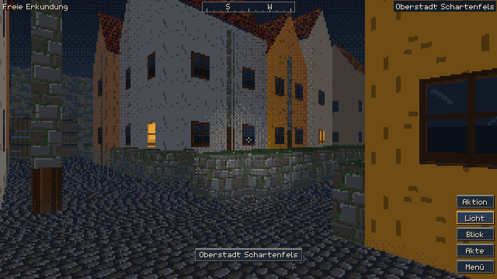
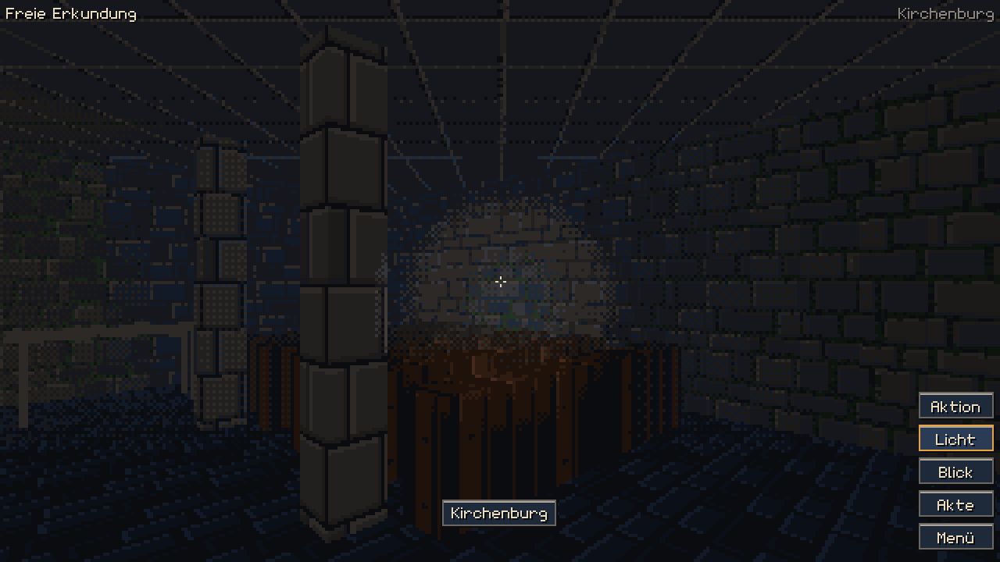
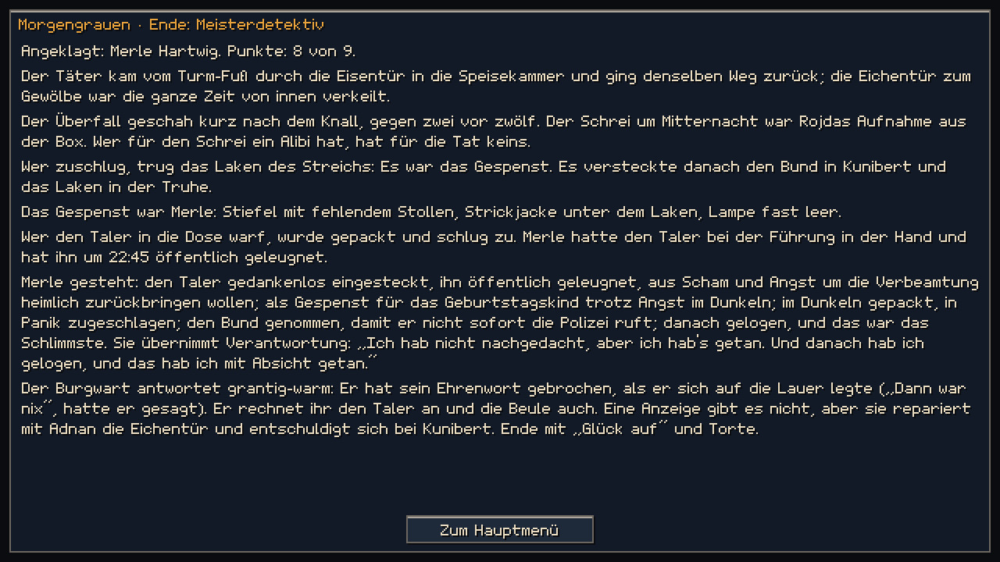
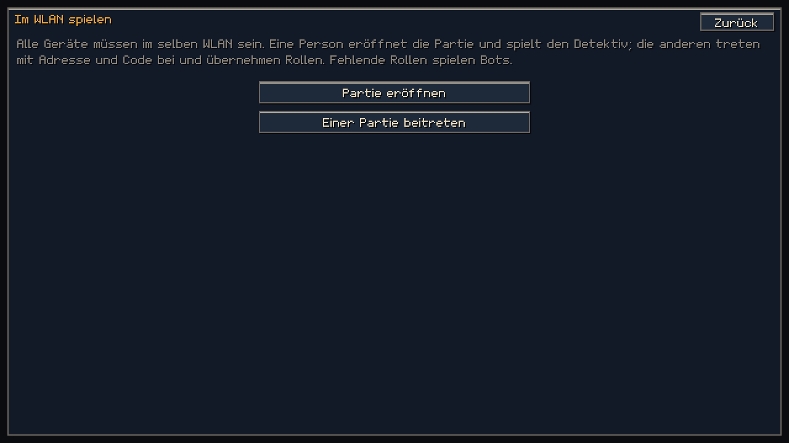
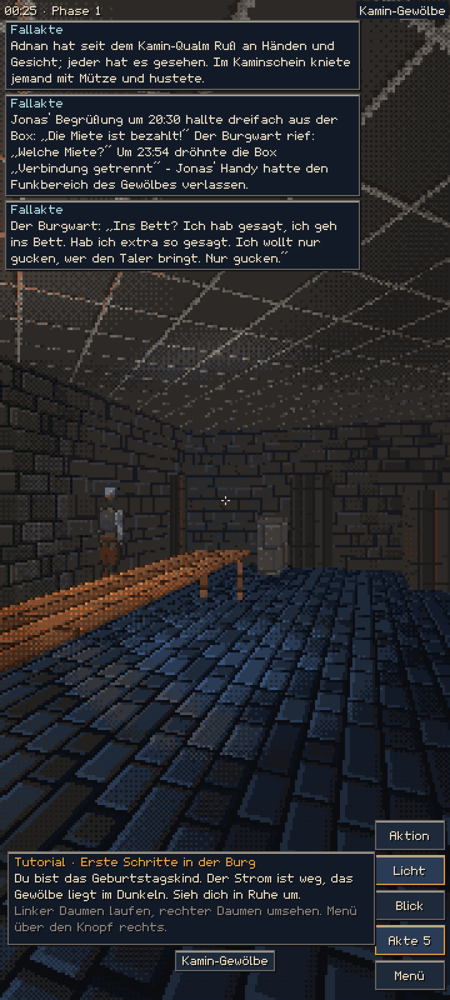

# Abschlussbericht · Nachtlauf „Spuk im Gewölbe – Burgstadt Schartenfels“

*Stand: siehe letzte Zeile. Maßgeblich für die Abnahme ist allein `belege/abnahme.txt`, erzeugt von `dart run tool/abnahme.dart`.*

## 1. Ergebnis in Kürze

Aus „Mordakte“ ist ein Ich-Perspektive-Krimi mit 2,5D-Pixelfiguren geworden. Er spielt in einer verschlossenen, nächtlichen Burgstadt im Stil siebenbürgischer Oberstädte. Der Fall „Spuk im Gewölbe“ folgt dem verbindlichen Kanon und ist an die Stadt angepasst; jede Anpassung steht in `kanon/ANPASSUNG.md`. Gespielt wird allein mit Bots oder im WLAN mit 4 bis 20 Rollen. Der Bestand („Klassische Fälle“) bleibt erreichbar.

- **Bedienung:** Touch, Tastatur mit Maus und Gamepad; Bildschirme quer und hoch.
- **Stadt:**
  - 160 Gebäude in 6 Vierteln, 59 betretbare Innenräume, davon 12 Fall-Orte.
  - Gangnetz, Wehrgang, Fledermäuse.
  - 44 Stadtbewohner mit eigenem Nachtplan.
- **Fall:**
  - 257 Kanon-Hinweise und 24 Stadt-Hinweise, 180 Gespräche, Entscheidungen, Punkte, Eingrenzung, vier Enden.
  - Detektivblick mit 7 Spurenarten; jede der 20 Rollen hat eine eigene Sichtschicht oder Fähigkeit; die Täterin kann Spuren verwischen.
  - Teilen an Einzelne oder an die Fallakte, mit Fäden zwischen Hinweisen.
- **Mehrspieler im lokalen Netz:** Lobby mit Code und Adresse. Fehlende Rollen spielen Bots, Spoiler sind geschützt.
- **Darstellung:**
  - Eigener Software-Rasterer mit fester 64-Farben-Palette.
  - 66 Figuren in 8 Richtungen mit Animationen, Porträts mit 4 Ausdrücken.
- **Rund ums Spiel:** Erzähler, Tutorial, prozedurale Klänge und Musik, Stadtkarte mit Schnellreise, Kompass, Speichern und Fortsetzen, Optionen.

## 2. Abnahme Z-01 … Z-14

Die Tabelle mit Messwerten und Belegen steht in `ABNAHME.md`, das Protokoll des vollständigen Testlaufs aller elf Ebenen in `belege/alle_tests_voll.txt`.

**Ergebnis:** `tool/abnahme.dart` bestätigt am Stand 580b4c2 **13 von 14** Kriterien (`belege/abnahme.txt`); alle elf Testebenen sind grün. Am Morgen (Stand a28178c) waren es 14 von 14. Danach kamen auf Wunsch des Nutzers Kanon v1.0 aus `main` (E41) und der Merge des Schlosskeller-Strangs (E49, E51) dazu, und die Inhaltsprüfung musste neu laufen. **Offen ist Z-12:** Die letzte Inhaltsrunde (25–27) urteilt „Leitplanken nein“. Unabhängige Gegenproben halten keinen der zehn schweren Befunde für haltbar, drei Gestaltungsfragen liegen beim Nutzer (`FUER-DEN-NUTZER.md`, E50).

Messwerte aus diesem Lauf:
- Spiellogik 0,15 ms je Bild (Grenze 4), Nachladespitze 21,7 ms (Grenze 50), Speicherwachstum 4,6 % (Grenze 10).
- Teilen kommt nach höchstens 41 ms an (Grenze 1000); Teilen spart 83 % der Schritte (Grenze 30).
- Erkundungsbots erreichen 134 von 134 Türen; 0 Konsolenfehler in 3 Geräteprofilen.

## 3. Bilder

**Hauptmenü und Erkundung mit Tutorial**

**Oberstadt: Marktviertel, Kirchhügel, Untere Stadt**

**Innenräume: Stadtmuseum, Kirchenburg**

**Fallakte, Lagerunde, Ende**

**Stadtkarte und WLAN-Spiel**

**Hochformat (Handy)**

**Figuren-Aufstellung: 66 Figuren, je vorne, seitlich und hinten**

**Porträts mit 4 Ausdrücken**

## 4. Prüfungen durch unabhängige Prüfer

- **Figuren (Z-03):**
  - Es gab 22 Sichtprüfungen. Die Prüfer maßen anfangs sehr verschieden (E30). Danach galt ein fester Maßstab (Z-03, Punkt 5a).
  - Auch mit festem Maßstab werteten Prüfer Fälle knapp an der Schwelle unterschiedlich (z. B. BW/B12, DET/B24). Seit E40 steckt der Maßstab deshalb im Figurenvergleich selbst: gleiche Farbfamilie an Rumpf und Beinen, Größe bis 5 Sprite-Pixel und gleicher Kopf gilt als verwechselbar. Der Generator verteilt die Bewohner danach, und `karten_test` prüft es.
  - Endrunde am Kartenstand fc94af9295: Sichtprüfer 19 und 20 unabhängig voneinander mit 0 verwechselbaren Paaren und 0 Regelverstößen.
  - Nach dem Kanon v1.0 aus main (E41) haben sich R03 (ohne Notizbuch, blaue Jeans) und R04 (Strickpullover) geändert. Neuer Kartenstand db8e0a6155: Sichtprüfer 21 und 22 melden je 0 Paare und 0 Verstöße.
  - R04s Pullover war im Bild nicht als Strick zu erkennen (Inhaltsrunde 19). Er ist jetzt ein eigenes Teil `oberteil-strickpulli` (E45). Am neuen Kartenstand b60891cc2b melden Sichtprüfer 23 und 24 je 0 Paare und 0 Verstöße.
  - Gefundene Fehler, die nur Menschenaugen sehen: Kopfbedeckungen in Haarfarben lasen sich als Haar (B13, B14, B34, B39). Die Regel dagegen steht jetzt im Generator und im Test.
- **Inhalt (Z-12):**
  - Zwölf Runden Gegenprüfung bis zur ersten Abnahme (A-702b bis m), danach weitere nach dem Kanon v1.0 (A-702n/o). Jede Runde fand feinere Punkte. Umgesetzt oder begründet abgewogen ist alles in E23 bis E42.
  - Kanon v1.0 brachte einen echten Widerspruch ins Overlay: Das Gespensterlaken ist jetzt Burgwäsche (Z-2140), unsere Stadt-Hinweise hatten es der Pension zugeschrieben. Er ist behoben, ebenso der übersehene Phasenbeginn (00:30 statt 00:25, Z-0030) und ein Harz-Rest (Osterode).
  - Darunter: das Herkunftsmuster in den Familienfeldern des Kanons (E38/E39, per Overlay, Kanon-Dateien unverändert), Altersbilder, Gruppenwörter („Putzfrau“, „Hausfrau“), Spuren-Echos in Stadttexten und eine geschlechtsbezogene Anrede der spielenden Person.
  - Letzte Runde vor dem Kanon v1.0 (A-702m, Stand a7f1985): Leitplanken ja, Kanontreu ja, Plagiatsfrei ja. Ihre 5 geringen Befunde stehen nach der Abbruchregel (E40) in `FUER-DEN-NUTZER.md`.
  - Nach dem Kanon v1.0 liefen die Runden 13 bis 24 (A-702n bis s, E42–E47). Umgesetzt wurden unter anderem: Laken als Burgwäsche, Phase 1 ab 00:30, Nebel nur im Tal und FM-1 im Spiel ohne Herkunft. Dazu kommen die Lampenmarke „VT · 3“ und die R01-Firma ohne Nachnamen, neutrale Färbungen bei R13 und R15 sowie „alkoholfrei“ bei jedem Punsch (mit Test).
  - **Offen:** Runde 23/24 urteilt „Leitplanken nein“, weil Täterin und Mietbetrüger deutsche Wurzeln haben, die falsche Fährte (R01) und die Hauptzeugin mit dem Streich (R02) nicht. Das ist die Anlage des Falls im Kanon (FM-1, GROBPLAN F-07). Die Möglichkeiten stehen in `FUER-DEN-NUTZER.md`.
  - Auf Nutzerentscheidung (N-02, E48) enthält das Spiel keine Herkunftsangaben mehr: kein Feld „Wurzeln“ und keine Herkunftsorte in den Familienfeldern; der Kanon des Krimidinners behält sie.
  - Runde 25–27 (A-702t) urteilt erneut „Leitplanken nein“. Zu jedem Befund „hoch“ oder „mittel“ lief eine unabhängige Gegenprobe: 10 von 10 nicht haltbar. Umgesetzt sind kleine Verbesserungen (E50). Offen sind drei Gestaltungsfragen: Haarfarben der Rollen im Kanon-Look, Alters- und Geschlechtermuster der Stadtbewohner und das Ergebnis DW3-3.
- **Leitplanken-Scanner:** 0 Treffer in allen Spieltexten.
- **Fairness:** Der Löser bestätigt für N = 4…20, dass jeder notwendige Schluss abgesichert ist. Das Durchspiel mit Bots endet bei jeder Rollenzahl als Meisterdetektiv. Teilen spart 72 % der Schritte.

## 5. Was in der Nacht schiefging (ehrlich)

- **Testskript (E28):** Der Gesamttest verschluckte rote Pakettests (`… || echo "keine Tests"`). Drei Commits trugen deshalb einen roten Datentest: 02ab9b5, d511fac und 7574641. Gefunden, behoben und für alle Commits nachgeprüft (`belege/historie_pakettests.txt`). Die Geschichte ist nicht umgeschrieben.
- **abnahme.dart (E31):** Der erste Lauf endete still ohne Ergebnis, weil ein Future an einem schon beendeten Strom hing. Das ist behoben.
- **Zeitangaben:** Zwei Einträge im Entscheidungslog trugen geschätzte statt gemessene Uhrzeiten. Sie sind korrigiert. Ein Stundeneintrag im Nachtprotokoll (gegen 03:00) fehlt und wurde zusammengefasst nachgetragen.
- **Leistungsspitze (E36):**
  - Messungen unter Parallellast (Agenten kompilierten gleichzeitig) zeigten beim Figurenbacken einzelne Spitzen von 27 und 54 ms Wanduhrzeit. Ein Lauf war deshalb rot.
  - Das Speicherbereinigungs-Protokoll schließt die Speicherbereinigung als Ursache aus. Die Ursache war Verdrängung durch andere Prozesse.
  - Seitdem misst `bin/leistung.dart` die Prozessorzeit des Spielthreads (`CLOCK_THREAD_CPUTIME_ID`); die Wanduhrzeit steht weiter als Information im Protokoll. Beleg in `belege/leistung_z09.txt`.
- **Viele Sichtprüf-Runden (E38–E40):** Nach den neuen Signaturteilen (Kameragurt, Kopfhörer) brauchte Z-03 vier weitere Prüferpaare (13 bis 20). Gefunden wurden: B13 mit einer Haube, die wie rotes Haar aussah; R06/R08; BW/B12; DET/B24. Meine Korrekturen von Hand haben das Problem dabei teils nur zum nächsten Nachbarn verschoben. Beendet hat das erst der Maßstab im Figurenvergleich selbst (E40).
- **Figurenkarten von Hand (E38):** Nach Sichtprüfer 13 habe ich vier Bewohnerkarten von Hand nachgeschärft. Die ersten Werte erzeugten drei neue enge Paare. Gefunden hat sie `karten_test` vor dem Commit; eingecheckt wurde erst die Fassung ohne Paare.
- **Zu früh auf main (E52):** Den Merge-Stand c54fe9c habe ich nach dem schnellen Test auf `main` gepusht. Der erste volle Lauf danach war rot: Im Web-Build fehlten die Asset-Manifeste. Ein zweiter voller Lauf am selben Commit war grün, und als derselbe Fehler um 17:27 wiederkam, zeigte ein Versuch die Ursache: Nach einem Wechsel der Build-Aufrufform (mit/ohne `-o`) schreibt Flutter die Manifeste nicht neu. Beide Prüfskripte leeren jetzt den Build-Cache, und `main` geht erst nach einem grünen vollen Lauf.

## 6. Nicht gebaut oder nur genähert

Siehe `FUER-DEN-NUTZER.md`. Kurz:

- Nicht gebaut: Neigen (Sensor-Abhängigkeit), Bildschirm wach halten beim Gastgeber, Suche im WLAN ohne Adresse und QR-Code, Wiederverbinden in der App, Desktop-Plattformordner.
- **Balancing:**
  - Spielzeit je Phase rund 7, 11 und 11 Minuten (Phase 1 seit E42 60 Spielminuten ab 00:30).
  - Bots lösen bei jeder Rollenzahl.
  - Feinabstimmung mit echten Gruppen steht aus.

## 7. Starten

Siehe `ANLEITUNG.md` (Start, Steuerung je Gerät, WLAN, Speichern, Optionen).

*Stand: 09.10. 09:17 (Europe/Berlin), Branch `nachtlauf/burgstadt`.*
