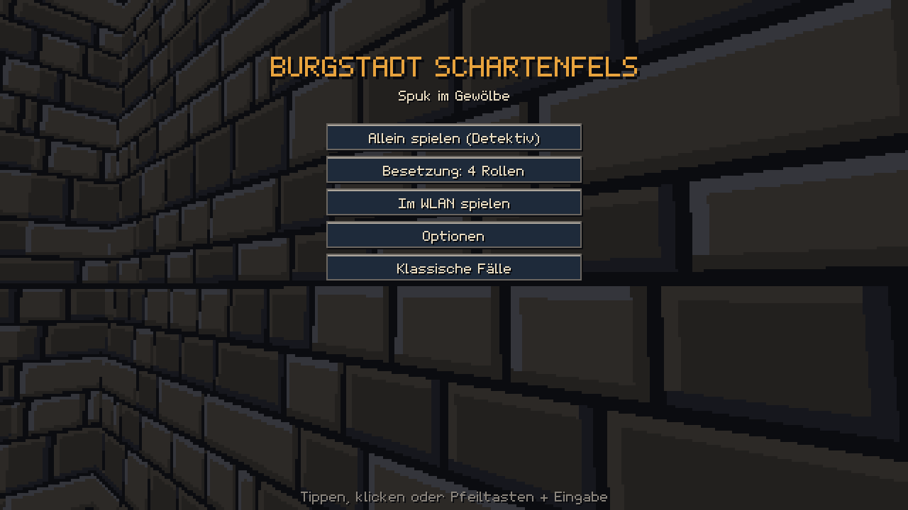
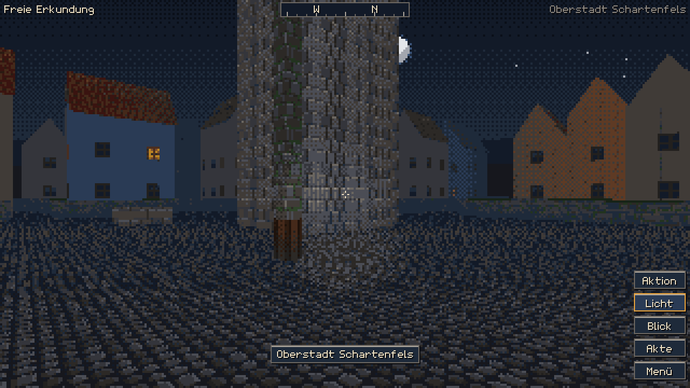
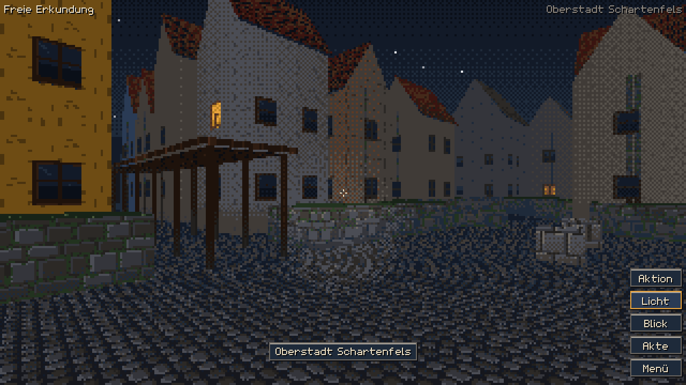
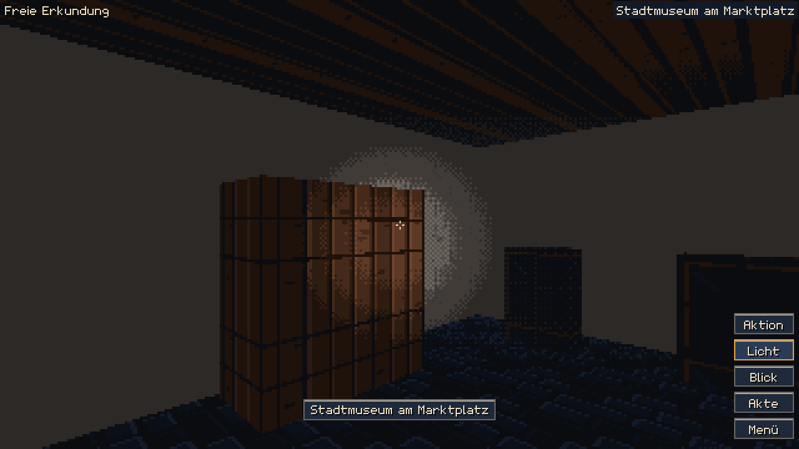
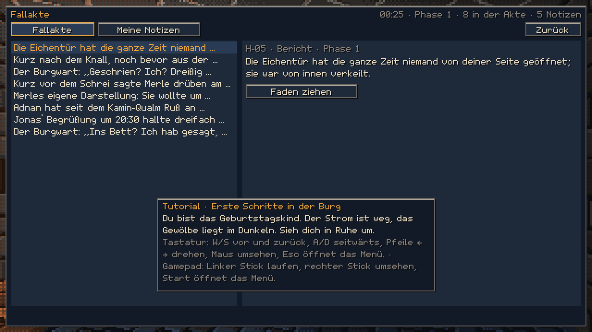
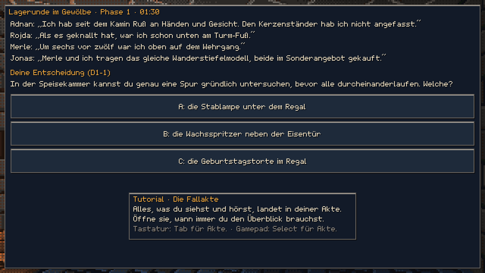
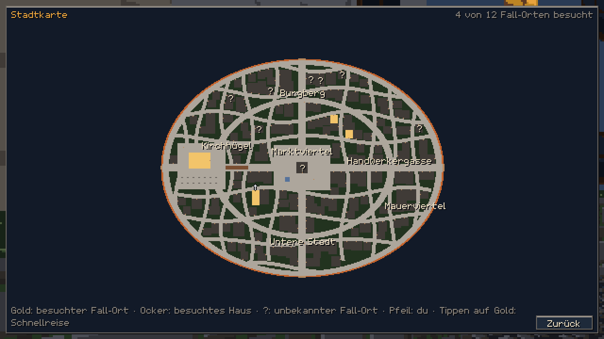
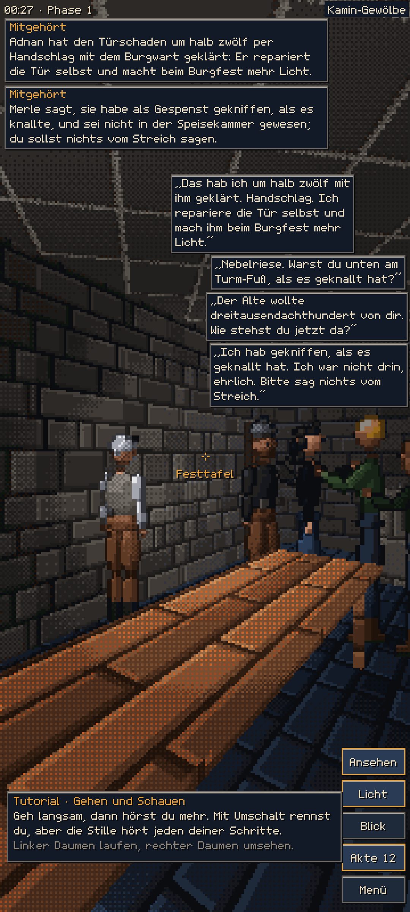
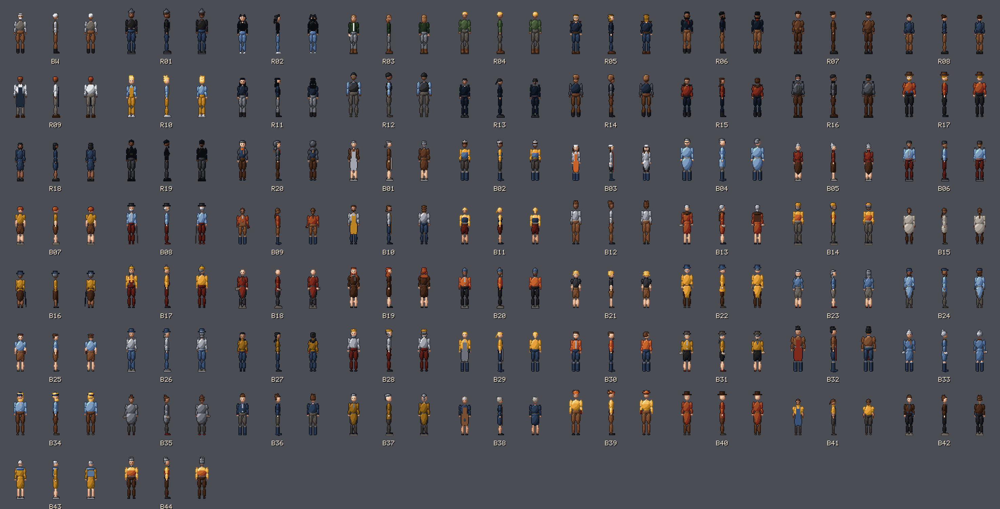
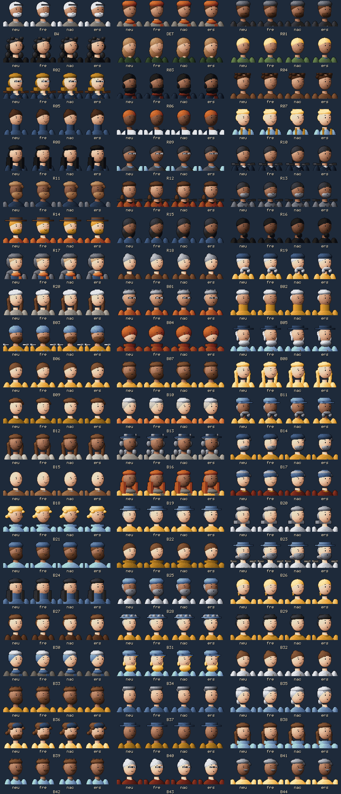

# MORGENBERICHT · 09.10. 07:00 (Europe/Berlin)

STAND · 07:00 · Phase 7 von 7 · Abnahme 12 von 14 (mit diesem Bericht; offen Z-03 und Z-12, Prüfer laufen) · Aufträge 46 von 50 · Agenten aktiv 3 · nächster Schritt: Sichtprüfer 13/14 und Inhaltsrunde 9 einbauen, dann Schlussabnahme

## Kurz gesagt

„Burgstadt Schartenfels“ ist spielbar. Du ermittelst in Ich-Perspektive in einer verschlossenen, nächtlichen Burgstadt den Fall „Spuk im Gewölbe“. Du spielst allein mit Bots oder im WLAN mit 4 bis 20 Rollen.

- Alle **elf Testebenen** laufen grün.
- **`tool/abnahme.dart`** bestätigt 11 von 14 Abnahmekriterien; mit diesem Morgenbericht wird Z-14 erfüllt, also 12 von 14; Messwerte in `ABNAHME.md`, Protokoll in `belege/abnahme.txt`.
- **Noch offen:**
  - **Z-03 (Figuren):** Die Endrunde der Sichtprüfung hatte am vorigen Figurenstand 0 Paare ergeben. Danach kamen zwei Signaturstücke aus dem Kanon dazu: der rote Kameragurt von R19 und der Kopfhörer von R02. Deshalb prüfen zwei Prüfer den neuen Stand gerade noch einmal.
  - **Z-12 (Inhalt):** Inhaltsrunde 9 läuft. Die Runden 5, 7 und 8 bestätigten „plagiatsfrei“ und meist auch die Leitplanken. Jede Runde fand noch feinere Anklänge; alle sind umgesetzt oder begründet.

## Was du dir zuerst ansehen solltest

1. `ANLEITUNG.md`: starten (`flutter run`) und Steuerung je Gerät.
2. `ABSCHLUSSBERICHT.md`: Bilder, Prüfungen und was schiefging.
3. `FUER-DEN-NUTZER.md`: was nur Menschen prüfen oder entscheiden können, z. B. echte Handys im WLAN, iOS und die Kanon-Anpassung „bewusstlos“ → „benommen“.

## Bilder

**Figuren-Aufstellung** (66 Figuren, vorne, seitlich, hinten; zwei unabhängige Prüfer der Endrunde: 0 verwechselbare Paare):

## Die Nacht in Zahlen

- **Commits:** 75 auf `nachtlauf/burgstadt`. Jeder Stand ist mit `tool/commit_gruen.sh` getestet und auf den Sicherungs-Branch gepusht; kein main, kein PR.
- **Pakettests:**
  - pixel_engine 273, burgstadt_core 247, burgstadt_spiel 47, room_host 5.
  - Bestand mordakte_core 22.
- **Stadt:**
  - 160 Gebäude, 59 Innenräume (12 Fall-Orte), 44 Bewohner.
  - Erkundungsbots erreichen alle 134 Türen.
- **Fall:**
  - Der Löser bestätigt N = 4…20.
  - Bots lösen bei jeder Rollenzahl.
  - Teilen spart 72 % der Schritte.
- **Mehrspieler:** Simulation mit 4/8/20 Teilnehmern ohne Abweichungen; Teilen kommt in ≤ 41 ms an.
- **Leistung (AOT, Faktor 4):**
  - Spiellogik 0,13 ms je Bild.
  - Nachladespitze 19 ms, Speicherwachstum 5 %.
- **Browser (3 Profile):** 0 Konsolenfehler, 0 fremde Abrufe.

## Ehrlich: was nicht glatt lief

- **Rote Tests im Testskript (E28):** Es verschluckte rote Pakettests. Drei Commits (02ab9b5, d511fac, 7574641) trugen deshalb einen roten Datentest. Alles ist gefunden, behoben und für jeden Commit nachgeprüft (`belege/historie_pakettests.txt`).
- **`abnahme.dart` (E31):** Der erste Lauf endete still. Das ist behoben.
- **Leistung (E36):** Ein Lauf unter Parallellast war rot, durch Verdrängung, nicht durch das Spiel. Seitdem misst das Werkzeug zusätzlich die Prozessorzeit des Spielthreads.
- **Inhaltsprüfung:** Sie brauchte viele Runden. Jede Runde fand feinere Anklänge, die alle umgesetzt oder begründet abgewogen sind (E23–E35).
- **Figuren:** Die Sichtprüfer maßen anfangs sehr unterschiedlich. Die Endrunde lief mit einem festen Maßstab aus Z-03.

## Wie es weitergeht

Ich arbeite weiter:
1. Die Ergebnisse der Sichtprüfer 13 und 14 sowie der Inhaltsrunde 9 einbauen.
2. Danach die Schlussabnahme mit `tool/abnahme.dart`. Nur dieses Werkzeug darf „ZIEL ERREICHT“ ausgeben.
3. Abschlussbericht fertigstellen.
